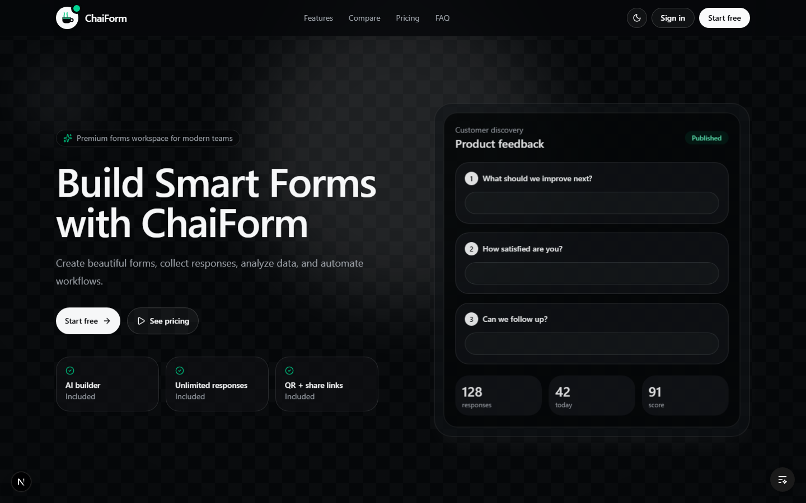
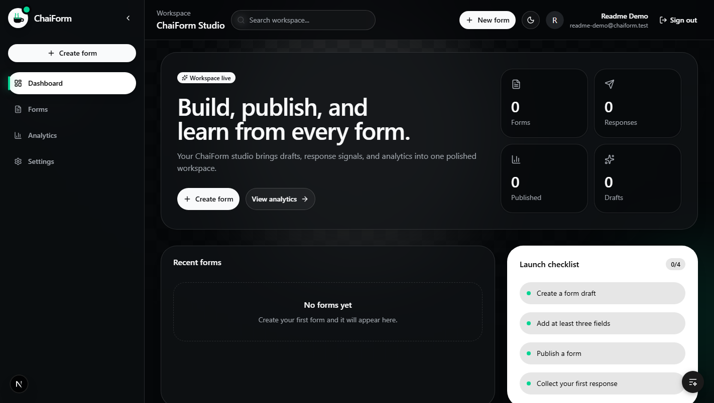
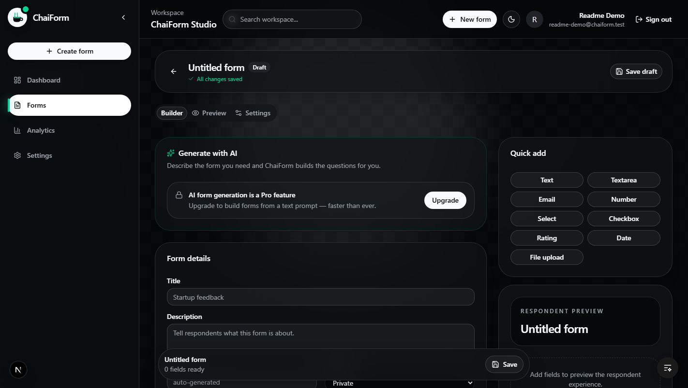

<div align="center">


# ChaiForm

**Build smart forms with AI — a polished alternative to Google Forms and Typeform.**

Describe the form you need and AI builds it. Collect unlimited responses, and let AI read them back to you.


</div>

---

## What is ChaiForm?

ChaiForm is an AI-powered form builder for teams who want forms that look as good as they work. It's free to start with unlimited forms and responses — no caps that pause your form mid-collection like other tools.

**Who it's for:** anyone who needs to collect feedback, run surveys, RSVPs, lead-gen, or quizzes without fighting a plain, rigid form tool.

## 📸 Screenshots

<p align="center">
  
  <em>Landing page</em>
</p>

<p align="center">
  
  <em>Dashboard</em>
</p>

<p align="center">
  
  <em>Create a form</em>
</p>

## 🚀 Quick Start

**Prerequisites:** Node.js 18+ · pnpm 9 (`corepack enable` picks up the pinned version)

```bash
# 1. Install dependencies
pnpm install

# 2. Set up environment
cp .env.example .env        # or: ./setup.sh (copies + links .env into workspaces)

# 3. Fill in the essentials in .env
#    MONGODB_URI, AUTH_SECRET, GOOGLE_CLIENT_ID, GOOGLE_CLIENT_SECRET
#    Generate AUTH_SECRET with: openssl rand -base64 32

# 4. Run web + API together
pnpm dev
```

- Web app → http://localhost:3000
- API → http://localhost:8000
- API docs (dev only) → http://localhost:8000/docs

## ✨ Features

- **🤖 AI form builder** — describe the form; AI generates the questions (Pro)
- **💡 AI response insights** — question-level summaries of what people said (Pro)
- **🧱 No-code editor** — 9+ field types, drafts, publishing, live previews
- **📊 Live analytics** — response trends and question-level charts
- **📥 Response inbox** — one-click CSV export
- **🔗 Sharing** — public links, QR codes, share dialogs
- **✉️ Email notifications** — get pinged on every new response
- **🔐 Auth** — Google OAuth + email/password, with email verification and password reset
- **⚡ Rate limiting** — per-IP protection on signup, submissions, and AI calls

## 🔧 Environment Variables

The full list lives in [`.env.example`](.env.example) — the source of truth. Key ones:

| Variable | Purpose |
| --- | --- |
| `MONGODB_URI` | MongoDB Atlas connection string |
| `AUTH_SECRET` | Auth.js secret (generate with `openssl rand -base64 32`) |
| `GOOGLE_CLIENT_ID` / `GOOGLE_CLIENT_SECRET` | Google OAuth app |
| `AI_API_KEY` / `AI_BASE_URL` / `AI_MODEL` | AI features — OpenAI-compatible (works with Gemini) |
| `RESEND_API_KEY` | Email notifications on new responses |

## 👩‍💻 For Developers

### Monorepo layout

```text
apps/
  api/        Express + tRPC API (port 8000)
  web/        Next.js App Router app (port 3000)

packages/
  auth/        Auth.js config & handlers
  database/    Mongoose models & connection
  services/    Business logic (auth, forms, AI, notifications)
  trpc/        Routers, context, procedures (public / protected / pro)
  ui/          Shared UI utilities
  validators/  Shared Zod schemas & env validation
```

### Scripts

```bash
pnpm dev          # run web + API together
pnpm build        # build all workspaces
pnpm lint         # lint all workspaces
pnpm check-types  # typecheck all workspaces
```

### API

The Express server exposes a tRPC router at `/trpc` plus an OpenAPI-compatible surface at `/api`. Routers: **auth** (signup, me, upgradeToPro…) and **forms** (CRUD, publish, submit, getResponses, getAnalytics, generateWithAI, summarizeResponses…). Interactive docs: `http://localhost:8000/docs`.

### Database

MongoDB with Mongoose — no migrations needed (schemas/indexes created lazily). Models: `users`, `forms` (fields embedded), `responses` (answers embedded). All ids are UUID strings.

## 🤝 Contributing

PRs are welcome! For feature ideas and planned work, see the [improvement checklist](improvement-checklist.md). Before opening a PR: run `pnpm lint` and `pnpm check-types`.

## 📄 License

Not yet licensed — reach out or open an issue if you'd like to use or contribute to the code.

---

<div align="center">

**Star the repo** ⭐ if ChaiForm is useful to you — and [start building](https://github.com/jemin7/ChaiForm) your first form.

</div>
